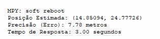
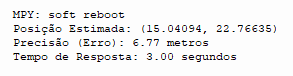
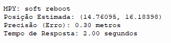
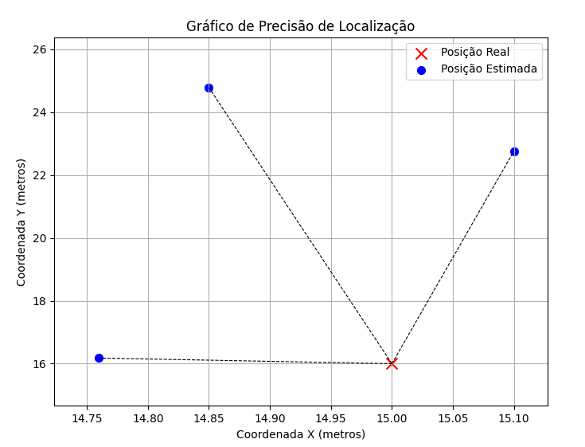

# Challenge-2024
Challenge John deere 1ECA - WS group

# Introdução:
   Nas fábricas da John Deere, enfrentamos desafios significativos no rastreamento de equipamentos e no gerenciamento de materiais, que levam a desperdícios e ineficiências. Problemas como variabilidade na produtividade, falhas de comunicação entre equipes e ineficiências operacionais têm impactado diretamente nossos custos, prazos de entrega e a qualidade dos produtos.

# Desenvolvimento:
  Desenvolvemos uma plataforma inteligente que proporciona visibilidade em tempo real de toda a operação. Utilizando trilaceração de sinal e integração em nuvem, nossa solução permite rastrear carros-kits, rebocadores e materiais com precisão. Gestores, poderão acompanhar o posicionamento exato dos recursos na fábrica, visualizar dados em tempo real para evitar a falta de materiais, e facilitar a comunicação entre as equipes, prevenindo problemas antes que impactem a produção.

Tecnologias utilizadas:
   Durante o desenvolvimento do projeto, foram utilizadas diferentes tecnologias, como trilaceração, leitura de RSSI e mac adress, exportação e importação de dados da nuvem, placa de circuitos ESP32 com módulo nrf24l01, bibliotecas de suporte, como matplotlib, requests, network, time, ujson, ssl, math e socket.
   O projeto foi estruturado em javascript, css e html com backend em python. As bibliotecas utilizadas foram requests, flask e math

# Resultados:
   A aplicação consiste em um projeto escalável para a localização de carros-kits e rebocadores na fábrica. Cada rebocador e cada kit serão equipados com uma placa de circuito ESP32, conectada a uma antena. Essa placa será responsável por calcular continuamente a localização do equipamento e enviar esses dados para a nuvem. O backend do servidor extrairá essas informações e as usará para mapear a posição dos rebocadores e kits em tempo real. Os montadores poderão solicitar o reabastecimento ou a entrega de um kit por meio de uma interface dedicada; o rebocador mais próximo do kit solicitado receberá uma notificação e deverá realizar a entrega no destino indicado na tela.

https://www.youtube.com/watch?v=iaZc8DCg9Lg

# Teste de Desempenho:
   ## Hardware/Software

   **Hardware**
   - **ESP32**: Dispositivo principal responsável pela captura dos sinais WiFi.
   - **Pontos de Acesso WiFi (IPHONE 7 plus, redmi note 12, roteador TP-link ARCHER)**: Para trilaceração

   **Software**
   - **Thonny IDE - Python**: Para programar o ESP32.
   - **VScode**: Para análise e visualização dos dados

   Testes:

1. **Precisão de Localização e Tempo de Resposta**:

   Sem antena:
   
   

   

   Com antena:
   
   
3. **Gráficos**:

   

# Discussão dos resultados

   Testes sem antena:
      Esses testse revelaram uma imprecisão significativa, com um erro médio de mais de 7 metros. A ausência da antena comprometeu a captação precisa dos sinais WiFi,   resultando em uma posição estimada distante da posição real e fora do intervalo aceitável. O tempo de resposta de 3 segundos indica uma execução lenta.

   Teste com antena:
      Com a antena, a precisão foi consideravelmente melhorada, com um erro de apenas 0.3 metros, o que é excelente para o sistema de localização. O tempo de resposta   também foi reduzido para 2 segundos, indicando que a antena não só aumentou a precisão, como também agilizou o processamento.

   Conclusão:
      Os resultados mostraram que a adição da antena melhora drasticamente a precisão e a eficiência do sistema de localização com ESP32. Sem antena, o erro de precisão era inaceitavelmente alto, enquanto o uso da antena reduziu o erro para uma margem satisfatória de 0.3 metros, com um tempo de resposta também mais rápido, mas ainda significativamente alto. Esses testes sugerem que o uso de uma antena é essencial para garantir a confiabilidade do sistema.

# Soluções futuras:
   Otimização do tempo de resposta:
      Dois segundos pode ser considerado rapido, mas na situação atual, pode causar atraso na produção, confusão ao usuário ou até acidentes. Pensando nisso foi decidido que será necessário reduzir o tempo de resposta do sistema e torna-lo mais ágil. Para isso, serão necessarios ajustes como a simplificação dos cálculos e o uso de algoritmos mais eficientes, fazendo o maior proveito possível do hardware utilizado
